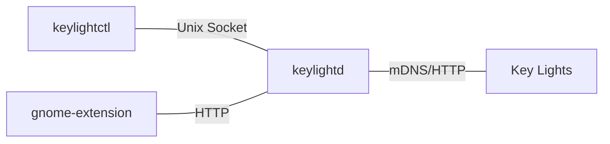

# keylightd

[](https://github.com/jmylchreest/keylightd/actions/workflows/build-release.yml)
[](https://github.com/jmylchreest/keylightd/releases)
[](https://dependabot.com)
[](https://codecov.io/gh/jmylchreest/keylightd)

**keylightd** is a daemon and CLI tool for managing Key Lights on your local network. While designed primarily for Elgato Key Lights, it may also support other HTTP-based lights with similar interfaces (if you have a compatible device not explicitly supported, please open a ticket).

## Features
- Automatic discovery of lights via mDNS
- Grouping of lights for batch control
- HTTP REST API for remote control
- Unix socket and CLI interface for local control

## Components
- **keylightd**: Daemon that discovers lights, persists configuration, and exposes APIs
- **keylightctl**: CLI tool for managing lights and groups



## Quick Start

Download the latest [release binaries](https://github.com/jmylchreest/keylightd/releases) and run:

```bash
# Start the daemon
./keylightd

# List discovered lights
./keylightctl light list

# Create a light group
./keylightctl group add "Office"

# Control a light group
./keylightctl group set Office on true
```

Configuration files are automatically generated on first save in `~/.config/keylightd/`.

## Installation Methods

### Homebrew (macOS/Linux)
Install via Homebrew using our official tap:

```bash
# Add the tap
brew tap jmylchreest/keylightd

# Install keylightd
brew install keylightd
```

Or install directly:
```bash
brew install jmylchreest/keylightd/keylightd
```

This installs both `keylightd` and `keylightctl` binaries plus a service to run the daemon.

### Arch Linux (AUR)
You can install it via AUR on Arch (package name is `keylightd-bin`). Add your user to the keylightd group to access the socket via CLI:

```bash
# Install via AUR helper (such as yay or paru)
paru -S keylightd-bin

# Add user to group for socket access
sudo usermod -a -G keylightd $USER

# Enable and start the service
sudo systemctl enable keylightd
sudo systemctl start keylightd
```

### GNOME Extension
An experimental GNOME extension for controlling lights from your desktop is available in the `contrib/gnome-extension` directory, from the releases page [here](https://github.com/jmylchreest/keylightd/releases), or from the GNOME extensions website [here](https://extensions.gnome.org/extension/8185/keylightd-control/)

## Documentation
For detailed documentation, see [github pages](https://jmylchreest.github.io/keylightd/)

## Contributing
PRs and issues are welcome! Please ensure all tests pass and code is formatted.

## License
MIT License - see the [LICENSE](LICENSE) file for details.
